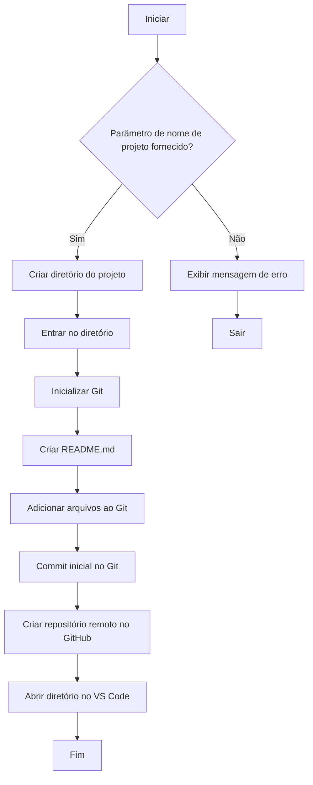

# Fluxo de Criação de Repositórios no GitHub

## Visão Geral
Automatização da criação de repositórios GitHub via linha de comando

## Funcionalidades
- Criação de repositórios locais e remotos
- Inicialização Git automática
- Criação de README.md padrão
- Integração com GitHub CLI
- Abertura automática no VS Code

## Fluxo de Trabalho


## Como Usar
1. Instale o GitHub CLI
2. Execute o script:
```bash
./create_project.sh nome-do-projeto
```

## Exemplos
Criando um repositório público:
```bash
./create_project.sh meu-projeto
```

Criando um repositório privado:
```bash
gh repo edit neaigd/meu-projeto --visibility private
```

## Documentação Completa
Consulte [docs/](docs/) para detalhes adicionais

## Contribuição
Siga o guia em [CONTRIBUTING.md](CONTRIBUTING.md)
