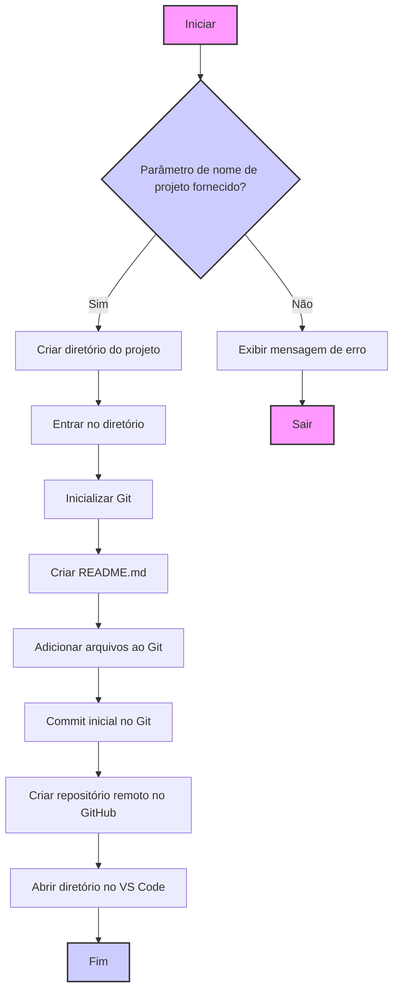

- [x] Ideia: Vou automatizar a criação de repositórios e documentar tudo.
- [x] Refinamento: Quero fazer tudo pela linha de comando.
- [x] Como: documentar e testar o passo a passo
- [x] Testar: e corrigir até funcionar
- [x] Criar o script para automatizar
- [ ] Gerar a documentação do script e do projeto
	- [ ] precisa conter o fluxo do que fiz
	- [ ] pode ser refinado por ai
	- [ ] posso utilizar o cline para me auxiliar com isso
- [x] Enviar essa nota para o repositório

Para criar um novo projeto no GitHub usando SSH e linha de comando no Linux, siga este fluxo de trabalho:


```shell
mkdir meu-projeto && cd meu-projeto
git init
git remote add origin git@github.com:neaigd/nome-do-repositorio.git
echo "# Meu Projeto" > README.md
git add .
git commit -m "Initial commit"
gh repo create "$ORGANIZACAO/$NOME_PROJETO" --public --source=. --remote=origin --push
git push -u origin main
```

Fluxo:



Exemplo de repositório criado:  https://github.com/neaigd/teste

vou modificar a exibição para privada 

gh repo edit neaigd/teste --visibility private